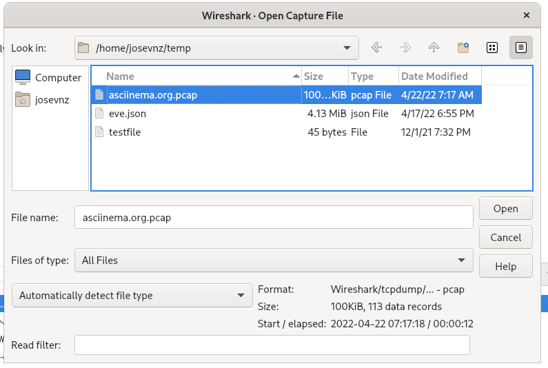
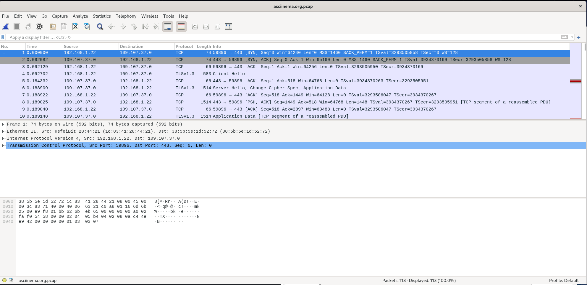
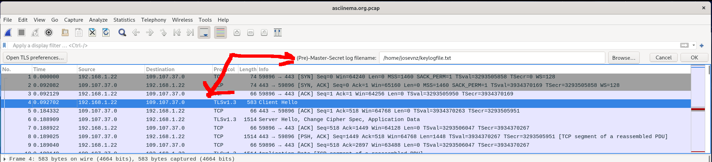
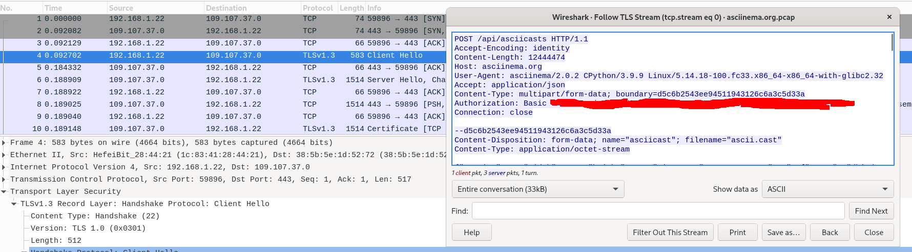

# Debugging applications with strace, wireshark and Python for fun


In this article I will show you a few techniques you can use to troubleshoot a program when is not behaving; this list is not universal and depending on what you are looking for it may not be enough to solve your problem.

Before we start you should be familiar with a few things:

* How to run commands on Linux
* Be familiar with protocols like DNS, HTTP, TLS
* A little of experience with a scripting language like Python

Don't worry too much. I will give you enough information, so you can follow the lesson and can follow the tutorial

And what will you learn?
* Basic usage of strace, nslookup, RPM
* Usage of some interesting features of the python debugger
* Analyze traffic with Wireshark


## Our problem: Failing to upload a file to asciinema

So I recorded an asciicast, using the *cool Open Source project* [asciinema](https://asciinema.org/docs/usage), for my small Open Source project [SuricataLog](https://pypi.org/project/SuricataLog) and decided to share it with the world. But unlike the other recordings, *this one refused to be uploaded*:


```shell=
[josevnz@dmaf5 SuricataLog]$ asciinema upload demo-ascii.cast 
asciinema: upload failed: <urlopen error [Errno 32] Broken pipe>
asciinema: retry later by running: asciinema upload demo-ascii.cast
```

Asciinema doesn't tell us much about the error; for example:
* What server and port does the tool tried to use to upload the file?
* Which part of the protocol handshake is failing
* Is it the destination a problem or is an issue on my side?

Will use a few tools to see what is going on

## Run the program with strace

What is [strace](https://strace.io/):

> strace is a diagnostic, debugging and instructional userspace utility for Linux. It is used to monitor and tamper with interactions between processes and the Linux kernel, which include system calls, signal deliveries, and changes of process state.

> System administrators, diagnosticians and troubleshooters will find it invaluable for solving problems with programs for which the source is not readily available since they do not need to be recompiled in order to trace them.

It is super useful when you don't have the source code of an application and yet you need to understand what is wrong when you call a program. Time to see it in action:

```shell=
josevnz@dmaf5 SuricataLog]$ strace asciinema upload demo-ascii.cast
xecve("/usr/bin/asciinema", ["asciinema", "upload", "demo-ascii.cast"], 0x7ffdcddb1160 /* 55 vars */) = 0
brk(NULL)                               = 0x55e912d58000
arch_prctl(0x3001 /* ARCH_??? */, 0x7fff2f136480) = -1 EINVAL (Invalid argument)
access("/etc/ld.so.preload", R_OK)      = -1 ENOENT (No such file or directory)
openat(AT_FDCWD, "/etc/ld.so.cache", O_RDONLY|O_CLOEXEC) = 3
fstat(3, {st_mode=S_IFREG|0644, st_size=92299, ...}) = 0
mmap(NULL, 92299, PROT_READ, MAP_PRIVATE, 3, 0) = 0x7f69dd26a000
close(3)                                = 0
# 
# Commented out LOTS output
# ...
close(4)                                = 0
socket(AF_INET, SOCK_DGRAM|SOCK_CLOEXEC, IPPROTO_IP) = 4
connect(4, {sa_family=AF_INET, sin_port=htons(443), sin_addr=inet_addr("109.107.38.233")}, 16) = 0
getsockname(4, {sa_family=AF_INET, sin_port=htons(33771), sin_addr=inet_addr("192.168.1.22")}, [28 => 16]) = 0
connect(4, {sa_family=AF_UNSPEC, sa_data="\0\0\0\0\0\0\0\0\0\0\0\0\0\0"}, 16) = 0
connect(4, {sa_family=AF_INET, sin_port=htons(443), sin_addr=inet_addr("109.107.37.0")}, 16) = 0
getsockname(4, {sa_family=AF_INET, sin_port=htons(35023), sin_addr=inet_addr("192.168.1.22")}, [28 => 16]) = 0
close(4)                                = 0
socket(AF_INET, SOCK_STREAM|SOCK_CLOEXEC, IPPROTO_TCP) = 4
connect(4, {sa_family=AF_INET, sin_port=htons(443), sin_addr=inet_addr("109.107.38.233")}, 16) = 0
setsockopt(4, SOL_TCP, TCP_NODELAY, [1], 4) = 0
getsockopt(4, SOL_SOCKET, SO_TYPE, [1], [4]) = 0
getsockname(4, {sa_family=AF_INET, sin_port=htons(55682), sin_addr=inet_addr("192.168.1.22")}, [128 => 16]) = 0
ioctl(4, FIONBIO, [0])                  = 0
getpeername(4, {sa_family=AF_INET, sin_port=htons(443), sin_addr=inet_addr("109.107.38.233")}, [16]) = 0
getpid()                                = 45070
getpid()                                = 45070
getpid()                                = 45070
getpid()                                = 45070
getpid()                                = 45070
getpid()                                = 45070
write(4, "\26\3\1\2\0\1\0\1\374\3\3\327\2*\v\316GT*\262\207\235\264\317\254\37$|,V\205\362"..., 517) = 517
read(4, "\26\3\3\0z", 5)                = 5
read(4, "\2\0\0v\3\3E\217G?\335.;\212\237pn\16\257$\2\324J\324y\17\306\263\325i\264p"..., 122) = 122
read(4, "\24\3\3\0\1", 5)               = 5
read(4, "\1", 1)                        = 1
read(4, "\27\3\3\0\27", 5)              = 5
read(4, "0{}\22t9\264\265\340j\362\30\342\360\234\205\1\370\33\246\1z'", 23) = 23
read(4, "\27\3\3\17\335", 5)            = 5
read(4, "\17\5\310\261\355\271\227oUaI\366\361]\3\275q)\5{\367z\20\233\345\352k?\371\272\23\237"..., 4061) = 4061
stat("/etc/pki/tls/certs/8d33f237.0", 0x7ffd20be3620) = -1 ENOENT (No such file or directory)
read(4, "\27\3\3\1\31", 5)              = 5
read(4, "t\27\337\366G6\226Qs\273\327\314,\205\221\222Xu\233\21%\0s\340\270\224\330\t\2774\222h"..., 281) = 281
read(4, "\27\3\3\0005", 5)              = 5
read(4, "\204{\314\232\311\0P-*$\245\315\271\236c\210N\315\5\371\364\23\235\16\0350N0K\246\336\374"..., 53) = 53
write(4, "\24\3\3\0\1\1\27\3\3\0005\361\311\347\t\254m#\273\204\350\16\343\34P\320sS\211\30\232<"..., 64) = 64
ioctl(4, FIONBIO, [0])                  = 0
write(4, "\27\3\3\1\251\271\2673-\30\313\253\363\320H0\224\370Q\353(#?,\216\3\341\315|J\353\303"..., 430) = 430
write(4, "\27\3\3@\21\20\221\240\331\2737\10\244pv\312B\n\rn\272\33\336T\216\f\303\374k\177c\25"..., 16406) = 16406
write(4, "\27\3\3@\21\214\30\262\240s\216\240\354e\31\304Q\337Oy\21y\373\241g\311\224)\26\320\10{"..., 16406) = 16406
write(4, "\27\3\3@\21\36\323\240\376\276\224\35\f\10!@\36D\347\33ay\2617Hpv\4d\267y7"..., 16406) = 16406
write(4, "\27\3\3@\21\366x\264\242O2\7?\7\334\221W\24\2\f)\"@\20\375~\354\243W\32\0c"..., 16406) = 16406
write(4, "\27\3\3@\21\354\32W\36\265g\304\314\376\205\315\20\22\10c\333\342\264\330\366SS\4\217\356:V"..., 16406) = 16406
write(4, "\27\3\3@\21\1\274\35\335\271n\235e\202\202\207\221~\313\0y\210\344\312\32r\347\306x]\241C"..., 16406) = 16406
write(4, "\27\3\3@\21I\315\202\274\342\274\26\335qx\22-\226\322\320\203\231\274wLB\250\252\2\352\367\""..., 16406) = 8716
write(4, "\377\4m\341\317\376SUr\rQ\221\207\22#\262\314B7\33_v\310\271\fl\v\242\fK\v?"..., 7690) = -1 EPIPE (Broken pipe)
--- SIGPIPE {si_signo=SIGPIPE, si_code=SI_USER, si_pid=45070, si_uid=1000} ---
close(4)                                = 0
close(3)                                = 0
write(2, "\33[0;31masciinema: upload failed:"..., 76asciinema: upload failed: <urlopen error [Errno 32] Broken pipe>
) = 76
write(2, "\33[0;31masciinema: retry later by"..., 79asciinema: retry later by running: asciinema upload demo-ascii.cast
) = 79
munmap(0x7fa1aa089000, 12447744)        = 0
rt_sigaction(SIGINT, {sa_handler=SIG_DFL, sa_mask=[], sa_flags=SA_RESTORER, sa_restorer=0x7fa1bad0fa70}, {sa_handler=0x7fa1baf551d0, sa_mask=[], sa_flags=SA_RESTORER, sa_restorer=0x7fa1bad0fa70}, 8) = 0
munmap(0x7fa1ac649000, 593920)          = 0
exit_group(1)                           = ?
+++ exited with 1 +++
```

Look at this socket call (```man 2 getpeername```):

```shell
getpeername(4, {sa_family=AF_INET, sin_port=htons(443), sin_addr=inet_addr("109.107.38.233")}, [16]) = 0
```

And below that like you can see that we are actually writing data to the website and the connection breaks:

```shell
write(4, "\27\3\3@\21\366x\264\242O2\7?\7\334\221W\24\2\f)\"@\20\375~\354\243W\32\0c"..., 16406) = 16406
write(4, "\27\3\3@\21\354\32W\36\265g\304\314\376\205\315\20\22\10c\333\342\264\330\366SS\4\217\356:V"..., 16406) = 16406
write(4, "\27\3\3@\21\1\274\35\335\271n\235e\202\202\207\221~\313\0y\210\344\312\32r\347\306x]\241C"..., 16406) = 16406
write(4, "\27\3\3@\21I\315\202\274\342\274\26\335qx\22-\226\322\320\203\231\274wLB\250\252\2\352\367\""..., 16406) = 8716
write(4, "\377\4m\341\317\376SUr\rQ\221\207\22#\262\314B7\33_v\310\271\fl\v\242\fK\v?"..., 7690) = -1 EPIPE (Broken pipe)
--- SIGPIPE {si_signo=SIGPIPE, si_code=SI_USER, si_pid=45070, si_uid=1000} ---
```

So who is '109.107.38.233'?:

```shell=
[josevnz@dmaf5 SuricataLog]$ nslookup 109.107.38.233
233.38.107.109.in-addr.arpa	name = cip-109-107-38-233.gb1.brightbox.com.
```

You can see on the [about](https://asciinema.org/about) webpage that brightbox.com provides the hosting of asciinema.

So what is wrong? It is not than the site is down or unreachable. Can we dig further?

## If I only had the source code... (deep diving with the Python debugger)

```shell=
[josevnz@dmaf5 SuricataLog]$ file /usr/bin/asciinema
/usr/bin/asciinema: Python script, ASCII text executable
```

Oh, yes we do!. Ever curious you open the asciinema script:

```python=
#!/usr/bin/python3
# EASY-INSTALL-ENTRY-SCRIPT: 'asciinema==2.0.2','console_scripts','asciinema'
import re
import sys 

# for compatibility with easy_install; see #2198
__requires__ = 'asciinema==2.0.2'

try:
    from importlib.metadata import distribution
except ImportError:
    try:
        from importlib_metadata import distribution
    except ImportError:
        from pkg_resources import load_entry_point


def importlib_load_entry_point(spec, group, name):
    dist_name, _, _ = spec.partition('==')
    matches = ( 
        entry_point
        for entry_point in distribution(dist_name).entry_points
        if entry_point.group == group and entry_point.name == name
    )   
    return next(matches).load()


globals().setdefault('load_entry_point', importlib_load_entry_point)


if __name__ == '__main__':
    sys.argv[0] = re.sub(r'(-script\.pyw?|\.exe)?$', '', sys.argv[0])
    sys.exit(load_entry_point('asciinema==2.0.2', 'console_scripts', 'asciinema')())
```

The main script was generated with '[easy install](https://setuptools.pypa.io/en/latest/deprecated/easy_install.html)', which means ``asciinema.py`` is just a wrapper around the interesting code; to find 
out where the interesting stuff is let's run the script through the Python [pdb debugger](https://www.redhat.com/sysadmin/python-debugger-pdb)

```shell=
[josevnz@dmaf5 SuricataLog]$ python3 -m pdb /usr/bin/asciinema upload demo-ascii.cast 
> /usr/bin/asciinema(3)<module>()
-> import re
(Pdb) n
> /usr/bin/asciinema(4)<module>()
-> import sys
(Pdb) c
asciinema: upload failed: <urlopen error [Errno 32] Broken pipe>
asciinema: retry later by running: asciinema upload demo-ascii.cast
The program exited via sys.exit(). Exit status: 1
```

*Not quite what we need*. The program runs, hits the exception, and then it restarts at the beginning.

Let's cheat a little. Was asciinema installed with an RPM (I use Fedora Linux)?

```shell=
[josevnz@dmaf5 SuricataLog]$ rpm -qif /usr/bin/asciinema
Name        : asciinema
Version     : 2.0.2
Release     : 6.fc33
```

And we are trying to upload a file, anything that looks like an uploader?

```shell=
josevnz@dmaf5 SuricataLog]$ rpm -qil asciinema|grep -i uploa
/usr/lib/python3.9/site-packages/asciinema/commands/__pycache__/upload.cpython-39.opt-1.pyc
/usr/lib/python3.9/site-packages/asciinema/commands/__pycache__/upload.cpython-39.pyc
/usr/lib/python3.9/site-packages/asciinema/commands/upload.py
```

Ah, getting interesting!. Let's open 'upload.py':

```python=
from asciinema.commands.command import Command
from asciinema.api import APIError


class UploadCommand(Command):

    def __init__(self, api, filename):
        Command.__init__(self)
        self.api = api 
        self.filename = filename

    def execute(self):
        try:
            result, warn = self.api.upload_asciicast(self.filename)

            if warn:
                self.print_warning(warn)

            self.print(result.get('message') or result['url'])

        except OSError as e:
            self.print_error("upload failed: %s" % str(e))
            return 1

        except APIError as e:
            self.print_error("upload failed: %s" % str(e))
            self.print_error("retry later by running: asciinema upload %s" % self.filename)
            return 1

        return 0
```

Let's put a few breakpoints inside the UploadCommand (Lines 14, 26 on my copy of the code):

```shell=
[josevnz@dmaf5 SuricataLog]$ python3 -m pdb /usr/bin/asciinema upload demo-ascii.cast 
> /usr/bin/asciinema(3)<module>()
-> import re
(Pdb) b /usr/lib/python3.9/site-packages/asciinema/commands/upload.py:14
Breakpoint 1 at /usr/lib/python3.9/site-packages/asciinema/commands/upload.py:14
(Pdb) c
> /usr/lib/python3.9/site-packages/asciinema/commands/upload.py(14)execute()
-> result, warn = self.api.upload_asciicast(self.filename)
(Pdb) c
> /usr/lib/python3.9/site-packages/asciinema/commands/upload.py(26)execute()
-> self.print_error("upload failed: %s" % str(e))
(Pdb) n
asciinema: upload failed: <urlopen error [Errno 32] Broken pipe>
> /usr/lib/python3.9/site-packages/asciinema/commands/upload.py(27)execute()
-> self.print_error("retry later by running: asciinema upload %s" % self.filename)
(Pdb) ll
 12  	    def execute(self):
 13  	        try:
 14 B	            result, warn = self.api.upload_asciicast(self.filename)
 15  	
 16  	            if warn:
 17  	                self.print_warning(warn)
 18  	
 19  	            self.print(result.get('message') or result['url'])
 20  	
 21  	        except OSError as e:
 22  	            self.print_error("upload failed: %s" % str(e))
 23  	            return 1
 24  	
 25  	        except APIError as e:
 26 B	            self.print_error("upload failed: %s" % str(e))
 27  ->	            self.print_error("retry later by running: asciinema upload %s" % self.filename)
 28  	            return 1
 29  	
 30  	        return 0
 ```
 
 We got an APIError. Anything interesting with that type of exception?
 
 ```shell
(Pdb) source APIError
 11  	class APIError(Exception):
 12  	    pass
 (Pdb) e.args
('<urlopen error [Errno 32] Broken pipe>',)

```

So nothing special, derived directly from ``Exception``. Also, the arguments to the exception are just the error message.

Of course next step is to see if this error comes from a known library (Search on the Internet [for the error](https://duckduckgo.com/?q=%3Curlopen+error+%5BErrno+32%5D+Broken+pipe%3E&ia=web)). And I found this issue on [GitHub](https://github.com/asciinema/asciinema/issues/335); Reading [further](https://github.com/asciinema/asciinema/issues/91) you can see than the generous author of Asciicast is paying the storage *from his own pocket* so all us can enjoy the online storage for free:

> The max size was set 2MB which appears to be too low. I have upped it to 5MB. This isn't much, but I'm paying for the storage (S3) from my own pocket, so I can't offer GBs of storage for every user. Let me know if that works for you. I'm fine with increasing it even more, but now I want to figure out the good middle ground between user needs and hosting costs.


So let's confirm this is indeed the cause:

```shell=
[josevnz@dmaf5 SuricataLog]$ ls -lh demo-ascii.cast 
-rw-rw-r-- 1 josevnz josevnz 12M Apr 21 15:44 demo-ascii.cast
```

So far the big size of the file seems to be the culprit.

I'm still running the debugger, I would love to see what asciinema modules were loaded, for that switch to the '*interact*' mode and get that listing with a [list comprehension](https://peps.python.org/pep-0202/) and a [regular expression](https://docs.python.org/3/howto/regex.html):

```shell=
(Pdb) interact
*interactive*
>>> import re
>>> import sys
>>> import pprint
>>> pprint.pprint([name for name in sys.modules.keys() if re.search('asciinema', name)], indent=True)
['asciinema.asciicast.events',
 'asciinema.asciicast.v1',
 'asciinema.asciicast.v2',
 'asciinema.asciicast',
 'asciinema.term',
 'asciinema.pty',
 'asciinema',
 'asciinema.config',
 'asciinema.commands',
 'asciinema.commands.command',
 'asciinema.commands.auth',
 'asciinema.asciicast.raw',
 'asciinema.http_adapter',
 'asciinema.urllib_http_adapter',
 'asciinema.api',
 'asciinema.commands.record',
 'asciinema.player',
 'asciinema.commands.play',
 'asciinema.commands.cat',
 'asciinema.commands.upload',
 'asciinema.__main__']
>>> 
```

The following look like could hold some clues:
* asciinema.urllib_http_adapter
* asciinema.commands.upload
* asciinema.http_adapter

Exit the debugger (or on another terminal) and search for the urllib_http_adapter:

```shell=
[josevnz@dmaf5 SuricataLog]$ find /usr/lib/python3.9/site-packages/asciinema/ -name 'urllib_http_adapter*'
/usr/lib/python3.9/site-packages/asciinema/__pycache__/urllib_http_adapter.cpython-39.opt-1.pyc
/usr/lib/python3.9/site-packages/asciinema/__pycache__/urllib_http_adapter.cpython-39.pyc
/usr/lib/python3.9/site-packages/asciinema/urllib_http_adapter.py
```

If you open the file you will see that 'post' method is the one we want to troubleshoot:

```python=
class URLLibHttpAdapter:

    def post(self, url, fields={}, files={}, headers={}, username=None, password=None):
        content_type, body = MultipartFormdataEncoder().encode(fields, files)

        headers = headers.copy()
        headers["Content-Type"] = content_type

        if password:
            auth = "%s:%s" % (username, password)
            encoded_auth = base64.encodebytes(auth.encode('utf-8'))[:-1]
            headers["Authorization"] = b"Basic " + encoded_auth

        request = Request(url, data=body, headers=headers, method="POST")

        try:
            response = urlopen(request)
            status = response.status
            headers = self._parse_headers(response)
            body = response.read().decode('utf-8')
        except HTTPError as e:
            status = e.code
            headers = {}
            body = e.read().decode('utf-8')
        except (http.client.RemoteDisconnected, URLError) as e:
            raise HTTPConnectionError(str(e))

        return (status, headers, body)

```

A breakpoint in line 65 will get us where we need to be:

```shell=
[josevnz@dmaf5 SuricataLog]$ python3 -m pdb /usr/bin/asciinema upload demo-ascii.cast 
> /usr/bin/asciinema(3)<module>()
-> import re
(Pdb) b /usr/lib/python3.9/site-packages/asciinema/urllib_http_adapter.py:65
Breakpoint 1 at /usr/lib/python3.9/site-packages/asciinema/urllib_http_adapter.py:65
(Pdb) c
> /usr/lib/python3.9/site-packages/asciinema/urllib_http_adapter.py(65)post()
-> headers = headers.copy()
(Pdb) ll
 62  	    def post(self, url, fields={}, files={}, headers={}, username=None, password=None):
 63  	        content_type, body = MultipartFormdataEncoder().encode(fields, files)
 64  	
 65 B->	        headers = headers.copy()
 66  	        headers["Content-Type"] = content_type
 67  	
 68  	        if password:
 69  	            auth = "%s:%s" % (username, password)
 70  	            encoded_auth = base64.encodebytes(auth.encode('utf-8'))[:-1]
 71  	            headers["Authorization"] = b"Basic " + encoded_auth
 72  	
 73  	        request = Request(url, data=body, headers=headers, method="POST")
 74  	
 75  	        try:
 76  	            response = urlopen(request)
 77  	            status = response.status
 78  	            headers = self._parse_headers(response)
 79  	            body = response.read().decode('utf-8')
 80  	        except HTTPError as e:
 81  	            status = e.code
 82  	            headers = {}
 83  	            body = e.read().decode('utf-8')
 84  	        except (http.client.RemoteDisconnected, URLError) as e:
 85  	            raise HTTPConnectionError(str(e))
 86  	
 87  	        return (status, headers, body)
(Pdb) args
self = <asciinema.urllib_http_adapter.URLLibHttpAdapter object at 0x7f59ed3e4640>
url = 'https://asciinema.org/api/asciicasts'
fields = {}
files = {'asciicast': ('ascii.cast', <_io.BufferedReader name='demo-ascii.cast'>)}
headers = {'User-Agent': 'asciinema/2.0.2 CPython/3.9.9 Linux/5.14.18-100.fc33.x86_64-x86_64-with-glibc2.32', 'Accept': 'application/json'}
username = 'XXXX'
password = 'XXXX0f1-1d73-43fc-XX36-c9d7ZZZAAAA'
```

Very interesting, we could use definitely use the following fields to exercise the upload functionality without Python (obtained using ``args`` from the debugger):

* url = 'https://asciinema.org/api/asciicasts'
* headers = {'User-Agent': 'asciinema/2.0.2 CPython/3.9.9 Linux/5.14.18-100.fc33.x86_64-x86_64-with-glibc2.32', 'Accept': 'application/json'}
* username = 'XXXX'
* password = 'XXXX0f1-1d73-43fc-XX36-c9d7ZZZAAAA'

What exception we will get? We set 2 more breakpoints and let the debugger run until it reaches them:

```shell=
(Pdb) b 81
Breakpoint 2 at /usr/lib/python3.9/site-packages/asciinema/urllib_http_adapter.py:81
(Pdb) b 85
Breakpoint 3 at /usr/lib/python3.9/site-packages/asciinema/urllib_http_adapter.py:85
(Pdb) c
> /usr/lib/python3.9/site-packages/asciinema/urllib_http_adapter.py(85)post()
-> raise HTTPConnectionError(str(e))
(Pdb) e
URLError(BrokenPipeError(32, 'Broken pipe'))
```

The type of the error is [BrokenPipeError](https://docs.python.org/3/library/exceptions.html#BrokenPipeError):

> A subclass of ConnectionError, raised when trying to write on a pipe while the other end has been closed, or trying to write on a socket which has been shutdown for writing. Corresponds to errno EPIPE and ESHUTDOWN.

One last thing, do we read the whole file in memory before sending it to the website?

```shell=
[josevnz@dmaf5 SuricataLog]$ python3 -m pdb /usr/bin/asciinema upload demo-ascii.cast 
> /usr/bin/asciinema(3)<module>()
-> import re
(Pdb) b /usr/lib/python3.9/site-packages/asciinema/urllib_http_adapter.py:49
Breakpoint 1 at /usr/lib/python3.9/site-packages/asciinema/urllib_http_adapter.py:49
(Pdb) c
> /usr/lib/python3.9/site-packages/asciinema/urllib_http_adapter.py(49)iter()
-> yield (data, len(data))
(Pdb) len(data)
12444283
```

12MB, not huge for today's computer memory but also not small.

Do you remember the parameters we managed to capture before with the help of the debugger (url, user, etc.)? We now know enough to use a different tool ([curl](https://curl.se/)) to try to upload the file:

```shell=
[josevnz@dmaf5 SuricataLog]$ curl --fail --http1.1 --verbose --user $USER:$(cat ~/.config/asciinema/install-id) https://asciinema.org/api/asciicasts --form asciicast=@demo-ascii.cast
*   Trying 109.107.37.0:443...
* Connected to asciinema.org (109.107.37.0) port 443 (#0)
* ALPN, offering http/1.1
* successfully set certificate verify locations:
*   CAfile: /etc/pki/tls/certs/ca-bundle.crt
  CApath: none
* TLSv1.3 (OUT), TLS handshake, Client hello (1):
* TLSv1.3 (IN), TLS handshake, Server hello (2):
* TLSv1.3 (IN), TLS handshake, Encrypted Extensions (8):
* TLSv1.3 (IN), TLS handshake, Certificate (11):
* TLSv1.3 (IN), TLS handshake, CERT verify (15):
* TLSv1.3 (IN), TLS handshake, Finished (20):
* TLSv1.3 (OUT), TLS change cipher, Change cipher spec (1):
* TLSv1.3 (OUT), TLS handshake, Finished (20):
* SSL connection using TLSv1.3 / TLS_AES_128_GCM_SHA256
* ALPN, server accepted to use http/1.1
* Server certificate:
*  subject: CN=*.asciinema.org
*  start date: Mar  9 06:02:26 2022 GMT
*  expire date: Jun  7 06:02:25 2022 GMT
*  subjectAltName: host "asciinema.org" matched cert's "asciinema.org"
*  issuer: C=US; O=Let's Encrypt; CN=R3
*  SSL certificate verify ok.
* Server auth using Basic with user 'XXXX'
> POST /api/asciicasts HTTP/1.1
> Host: asciinema.org
> Authorization: Basic XXXXX=
> User-Agent: curl/7.71.1
> Accept: */*
> Content-Length: 12444495
> Content-Type: multipart/form-data; boundary=------------------------0d76dac3e1f8aed4
> Expect: 100-continue
> 
* TLSv1.3 (IN), TLS handshake, Newsession Ticket (4):
* Mark bundle as not supporting multiuse
< HTTP/1.1 100 Continue
* Mark bundle as not supporting multiuse
* The requested URL returned error: 413 Request Entity Too Large
* Closing connection 0
* TLSv1.3 (OUT), TLS alert, close notify (256):
curl: (22) The requested URL returned error: 413 Request Entity Too Large

```

The error `413 Request Entity Too Large` [means](https://developer.mozilla.org/en-US/docs/web/http/status/413):

> The HTTP 413 Payload Too Large response status code indicates that the request entity is larger than limits defined by server; the server might close the connection or return a Retry-After header field.

So curl is much better than Python on telling us the truth on why our file was rejected.

How much data we managed to transmit before our connection was cut off? Let's see if using a packet sniffer we can find that out.

## Using Wireshark and the SSLKEYLOGFILE to inspect the HTTP traffic

You can capture the traffic between your machine and the asciinema website using a network sniffer like [Wireshark](https://wireshark.org) or the well known [tcpdump](https://www.tcpdump.org/). The traffic will be encrypted as we use HTTPS, but using a feature supported by many programs known as a '[TLS master encryption secrets](https://www.paolotagliaferri.com/overview-of-transport-layer-security-protocol-tls-1-3/)' you can decrypt the session. For that let's enable the [feature](https://everything.curl.dev/usingcurl/tls/sslkeylogfile) on the client:

```shell=
export SSLKEYLOGFILE=$HOME/keylogfile.txt
```

If is supported, the $SSLKEYLOGFILE file will be populated with the keys:

```shell=
[josevnz@dmaf5 SuricataLog]$ export SSLKEYLOGFILE=$HOME/keylogfile.txt
[josevnz@dmaf5 SuricataLog]$ /usr/bin/asciinema upload demo-ascii.cast 
asciinema: upload failed: <urlopen error [Errno 32] Broken pipe>
asciinema: retry later by running: asciinema upload demo-ascii.cast
[josevnz@dmaf5 SuricataLog]$ ls -l $SSLKEYLOGFILE
-rw-rw-r-- 1 josevnz josevnz 832 Apr 21 21:02 /home/josevnz/keylogfile.txt

[josevnz@dmaf5 SuricataLog]$ cat /home/josevnz/keylogfile.txt

# TLS secrets log file, generated by OpenSSL / Python
SERVER_HANDSHAKE_TRAFFIC_SECRET 2987e32066d608a3de0cdd896f62801290045c2616abfaef5fac1c6986131847 4dd1a1bc1261a84886b28ee72798d89ba77d7de7051b3dcdafd548a621ed1124
EXPORTER_SECRET 2987e32066d608a3de0cdd896f62801290045c2616abfaef5fac1c6986131847 1ec8d94b7ec373a984abed25fa0dfaa6346fe67feea0516d7e2e46a666a12614
SERVER_TRAFFIC_SECRET_0 2987e32066d608a3de0cdd896f62801290045c2616abfaef5fac1c6986131847 e1d8fa6dba5eea00d4e52af0ce7e7007da0ade4c9dd9da3d9a060b55880531f1
CLIENT_HANDSHAKE_TRAFFIC_SECRET 2987e32066d608a3de0cdd896f62801290045c2616abfaef5fac1c6986131847 903bf381f927d783e72846201e87203ff130d9cf21f84cf0b923834d69c3fe76
CLIENT_TRAFFIC_SECRET_0 2987e32066d608a3de0cdd896f62801290045c2616abfaef5fac1c6986131847 495b5acf783869d74a7521e3b9c3f7bfc6dbc25e24ba95f684e96f6b2a435206
SERVER_HANDSHAKE_TRAFFIC_SECRET 82cab66e906c3cd3c58b3aeeecd66b2a12e521704d3e19e2f008550705e78e00 5a0d699640bd460530bd38148cf979e585b9a43c1bd545974561df18841fa5f4
EXPORTER_SECRET 82cab66e906c3cd3c58b3aeeecd66b2a12e521704d3e19e2f008550705e78e00 32b69cb41b8db36371e7d207a45e20d401bb05e0cd8bf492e3ace009e2845d12
SERVER_TRAFFIC_SECRET_0 82cab66e906c3cd3c58b3aeeecd66b2a12e521704d3e19e2f008550705e78e00 1f42b4392b2cc14789c4eaec4dae275c6a040ae3b11fc6bba58c90c7b80caa96
CLIENT_HANDSHAKE_TRAFFIC_SECRET 82cab66e906c3cd3c58b3aeeecd66b2a12e521704d3e19e2f008550705e78e00 bd93073bda56e559743a1f1ffc48c062089addcfc007c7defe08c28ac0ee6287
CLIENT_TRAFFIC_SECRET_0 82cab66e906c3cd3c58b3aeeecd66b2a12e521704d3e19e2f008550705e78e00 32b615c0dd25cb7b430a0cff44871e3263bd67af973e4b2f7fb19aab4df468d8
SERVER_HANDSHAKE_TRAFFIC_SECRET 68dcc859bc4edb51354a9f583e036d0b2787a337ee894e253925e273a5cd3889 a52a20827ce04dfc4ee557608ed5a0bfb6794ace0c4a1b69a1d56e5f16d8570b
EXPORTER_SECRET 68dcc859bc4edb51354a9f583e036d0b2787a337ee894e253925e273a5cd3889 8179afb8e7c7a77e35143c40a6bb62ccea2e644e48cc95b91b05f525bc59ada7
SERVER_TRAFFIC_SECRET_0 68dcc859bc4edb51354a9f583e036d0b2787a337ee894e253925e273a5cd3889 3d4abf6a9ea06395648a45428ca78c24962d8cc11440fe1d72f035ae35e61010
CLIENT_HANDSHAKE_TRAFFIC_SECRET 68dcc859bc4edb51354a9f583e036d0b2787a337ee894e253925e273a5cd3889 1d812a6c3c012a8fa4a6017ee573b47a5b361d15b861938ebca9194ecbc2a250
CLIENT_TRAFFIC_SECRET_0 68dcc859bc4edb51354a9f583e036d0b2787a337ee894e253925e273a5cd3889 6348a88dc9b6a350d72a7154140b824db80ba4f48c9e1fabcee76da8d248b041
```

Good. Next step is to capture the traffic. Will use [tcpdump](https://www.tcpdump.org/) with a [simple expression](https://www.tcpdump.org/papers/ethereal-tcpdump.pdf) to filter out the captured traffic:

```shell=
[josevnz@dmaf5 temp]$ sudo tcpdump -i eno1 -v -v -v 'host asciinema.org' -w ~/temp/asciinema.org.pcap
dropped privs to tcpdump
tcpdump: listening on eno1, link-type EN10MB (Ethernet), snapshot length 262144 bytes
```

And in another window the run the asciinema client (will do it twice to have more data):

```shell=
[josevnz@dmaf5 SuricataLog]$ /usr/bin/asciinema upload demo-ascii.cast 
asciinema: upload failed: <urlopen error [Errno 32] Broken pipe>
asciinema: retry later by running: asciinema upload demo-ascii.cast
[josevnz@dmaf5 SuricataLog]$ 
[josevnz@dmaf5 SuricataLog]$ /usr/bin/asciinema upload demo-ascii.cast 
asciinema: upload failed: <urlopen error [Errno 104] Connection reset by peer>
asciinema: retry later by running: asciinema upload demo-ascii.cast
```

Kill now the tcpdump capture on the other window

```shell=
tcpdump: listening on eno1, link-type EN10MB (Ethernet), snapshot length 262144 bytes
^C113 packets captured
118 packets received by filter
0 packets dropped by kernel
```

Let's replay the pcap file to see what got recorded:

```shell=
[josevnz@dmaf5 temp]$ tcpdump -r ~/temp/asciinema.org.pcap
reading from file /home/josevnz/temp/asciinema.org.pcap, link-type EN10MB (Ethernet), snapshot length 262144
07:17:18.244941 IP dmaf5.home.59896 > cip-109-107-37-0.gb1.brightbox.com.https: Flags [S], seq 1651239781, win 64240, options [mss 1460,sackOK,TS val 3293505858 ecr 0,nop,wscale 7], length 0
07:17:18.337023 IP cip-109-107-37-0.gb1.brightbox.com.https > dmaf5.home.59896: Flags [S.], seq 2395275599, ack 1651239782, win 65160, options [mss 1460,sackOK,TS val 3934370169 ecr 3293505858,nop,wscale 7], length 0
07:17:18.337070 IP dmaf5.home.59896 > cip-109-107-37-0.gb1.brightbox.com.https: Flags [.], ack 1, win 502, options [nop,nop,TS val 3293505950 ecr 3934370169], length 0
07:17:18.337643 IP dmaf5.home.59896 > cip-109-107-37-0.gb1.brightbox.com.https: Flags [P.], seq 1:518, ack 1, win 502, options [nop,nop,TS val 3293505951 ecr 3934370169], length 517
07:17:18.429273 IP cip-109-107-37-0.gb1.brightbox.com.https > dmaf5.home.59896: Flags [.], ack 518, win 506, options [nop,nop,TS val 3934370263 ecr 3293505951], length 0
07:17:18.433850 IP cip-109-107-37-0.gb1.brightbox.com.https > dmaf5.home.59896: Flags [.], seq 1:1449, ack 518, win 506, options [nop,nop,TS val 3934370267 ecr 3293505951], length 1448
07:17:18.433863 IP dmaf5.home.59896 > cip-109-107-37-0.gb1.brightbox.com.https: Flags [.], ack 1449, win 501, options [nop,nop,TS val 3293506047 ecr 3934370267], length 0
07:17:18.433966 IP cip-109-107-37-0.gb1.brightbox.com.https > dmaf5.home.59896: Flags [P.], seq 1449:2897, ack 518, win 506, options [nop,nop,TS val 3934370267 ecr 3293505951], length 1448
07:17:18.433981 IP dmaf5.home.59896 > cip-109-107-37-0.gb1.brightbox.com.https: Flags [.], ack 2897, win 496, options [nop,nop,TS val 3293506047 ecr 3934370267], length 0
07:17:18.434089 IP cip-109-107-37-0.gb1.brightbox.com.https > dmaf5.home.59896: Flags [.], seq 2897:4345, ack 518, win 506, options [nop,nop,TS val 3934370267 ecr 3293505951], length 1448
...
07:17:30.612523 IP cip-109-107-37-0.gb1.brightbox.com.https > dmaf5.home.59898: Flags [.], ack 11148, win 501, options [nop,nop,TS val 3934382447 ecr 3293518134], length 0
07:17:30.612524 IP cip-109-107-37-0.gb1.brightbox.com.https > dmaf5.home.59898: Flags [.], ack 12596, win 501, options [nop,nop,TS val 3934382447 ecr 3293518134], length 0
07:17:30.612558 IP dmaf5.home.59898 > cip-109-107-37-0.gb1.brightbox.com.https: Flags [.], seq 35764:37212, ack 4724, win 499, options [nop,nop,TS val 3293518226 ecr 3934382447], length 1448
07:17:30.612563 IP dmaf5.home.59898 > cip-109-107-37-0.gb1.brightbox.com.https: Flags [P.], seq 37212:38660, ack 4724, win 499, options [nop,nop,TS val 3293518226 ecr 3934382447], length 1448
07:17:30.612637 IP dmaf5.home.59898 > cip-109-107-37-0.gb1.brightbox.com.https: Flags [.], seq 38660:40108, ack 4724, win 499, options [nop,nop,TS val 3293518226 ecr 3934382447], length 1448
07:17:30.612643 IP dmaf5.home.59898 > cip-109-107-37-0.gb1.brightbox.com.https: Flags [P.], seq 40108:41556, ack 4724, win 499, options [nop,nop,TS val 3293518226 ecr 3934382447], length 1448
07:17:30.613064 IP cip-109-107-37-0.gb1.brightbox.com.https > dmaf5.home.59898: Flags [P.], seq 4724:5080, ack 12596, win 501, options [nop,nop,TS val 3934382448 ecr 3293518134], length 356
07:17:30.613106 IP cip-109-107-37-0.gb1.brightbox.com.https > dmaf5.home.59898: Flags [P.], seq 5080:5104, ack 12596, win 501, options [nop,nop,TS val 3934382448 ecr 3293518134], length 24
07:17:30.614231 IP cip-109-107-37-0.gb1.brightbox.com.https > dmaf5.home.59898: Flags [R.], seq 5104, ack 12596, win 501, options [nop,nop,TS val 3934382448 ecr 3293518134], length 0
```

Time to fire up wireshark. I like to use a GUI for this as the filtering capabilities are nice, and you can explore the contents of the PCAP file much easier.



The contents of the traffic capture:



So we follow the first time we got a TLS hello message, right-click on the protocol preferences -> Transport Layer Security and then  "pre-Master-Secret log filename":



Now time for the fun part. If you right-click the first hello message and say "follow TLS stream" a new window will open the whole conversation to the moment we got our connection reset, no encryption! 



So we only managed to sent 33KB before being cut-off by the asciinema server. How rude! :satisfied: 

Because the data payload is not so big I will show it to you next, please pay attention at the following: 

1. I changed the Authorization: Basic contents as I don't want to leak my user/password encoded in base64:
2. Content-Length: 12444474. That's how asciinema knows how big is the file we want to upload, so the server rejects
3. Asciinema uses Nginx
4. You can see the close message at the end (entity too large)

```
POST /api/asciicasts HTTP/1.1
Accept-Encoding: identity
Content-Length: 12444474
Host: asciinema.org
User-Agent: asciinema/2.0.2 CPython/3.9.9 Linux/5.14.18-100.fc33.x86_64-x86_64-with-glibc2.32
Accept: application/json
Content-Type: multipart/form-data; boundary=d5c6b2543ee94511943126c6a3c5d33a
Authorization: Basic XXXXX=
Connection: close

--d5c6b2543ee94511943126c6a3c5d33a
Content-Disposition: form-data; name="asciicast"; filename="ascii.cast"
Content-Type: application/octet-stream

{"version": 2, "width": 203, "height": 32, "timestamp": 1650568938, "env": {"SHELL": "/bin/bash", "TERM": "xterm-256color"}}
[0.191182, "o", "\u001b]777;notify;Command completed;eve_log.py --format table --timestamp '2022-02-23T18:22:24.405139+0000' test/eve.json\u001b\\\u001b]777;precmd\u001b\\\u001b]0;josevnz@dmaf5:~/SuricataLog-Logging-features-branch\u001b\\"]
[0.19215, "o", "\u001b]7;file://dmaf5/home/josevnz/SuricataLog-Logging-features-branch\u001b\\"]
[0.192399, "o", "[josevnz@dmaf5 SuricataLog-Logging-features-branch]$ "]
[1.000538, "o", "Let me show you how you can filter your Suricata alerts, displaying the results in different formats"]
[4.506902, "o", "\r\u001b[C\u001b[C\u001b[C\u001b[C\u001b[C\u001b[C\u001b[C\u001b[C\u001b[C\u001b[C\u001b[C\u001b[C\u001b[C\u001b[C\u001b[C\u001b[C\u001b[C\u001b[C\u001b[C\u001b[C\u001b[C\u001b[C\u001b[C\u001b[C\u001b[C\u001b[C\u001b[C\u001b[C\u001b[C\u001b[C\u001b[C\u001b[C\u001b[C\u001b[C\u001b[C\u001b[C\u001b[C\u001b[C\u001b[C\u001b[C\u001b[C\u001b[C\u001b[C\u001b[C\u001b[C\u001b[C\u001b[C\u001b[C\u001b[C\u001b[C\u001b[C\u001b[C\u001b[C"]
[4.921813, "o", "\u001b[1@#"]
[5.170393, "o", "\u001b[1@ "]
[5.538486, "o", "\u001b[C\u001b[C\u001b[C\u001b[C\u001b[C\u001b[C\u001b[C\u001b[C\u001b[C\u001b[C\u001b[C\u001b[C\u001b[C\u001b[C\u001b[C\u001b[C\u001b[C\u001b[C\u001b[C\u001b[C\u001b[C\u001b[C\u001b[C\u001b[C\u001b[C\u001b[C\u001b[C\u001b[C\u001b[C\u001b[C\u001b[C\u001b[C\u001b[C\u001b[C\u001b[C\u001b[C\u001b[C\u001b[C\u001b[C\u001b[C\u001b[C\u001b[C\u001b[C\u001b[C\u001b[C\u001b[C\u001b[C\u001b[C\u001b[C\u001b[C\u001b[C\u001b[C\u001b[C\u001b[C\u001b[C\u001b[C\u001b[C\u001b[C\u001b[C\u001b[C\u001b[C\u001b[C\u001b[C\u001b[C\u001b[C\u001b[C\u001b[C\u001b[C\u001b[C\u001b[C\u001b[C\u001b[C\u001b[C\u001b[C\u001b[C\u001b[C\u001b[C\u001b[C\u001b[C\u001b[C\u001b[C\u001b[C\u001b[C\u001b[C\u001b[C\u001b[C\u001b[C\u001b[C\u001b[C\u001b[C\u001b[C\u001b[C\u001b[C\u001b[C\u001b[C\u001b[C\u001b[C\u001b[C\u001b[C\u001b[C"]
[6.914337, "o", "\r\n"]
[6.918708, "o", "\u001b]777;notify;Command completed;# Let me show you how you can filter your Suricata alerts, displaying the results in different formats\u001b\\\u001b]777;precmd\u001b\\\u001b]0;josevnz@dmaf5:~/SuricataLog-Logging-features-branch\u001b\\"]
[6.920219, "o", "\u001b]7;file://dmaf5/home/josevnz/SuricataLog-Logging-features-branch\u001b\\"]
[6.920352, "o", "[josevnz@dmaf5 SuricataLog-Logging-features-branch]$ "]
[8.202111, "o", "1"]
[8.658197, "o", ")"]
[8.962176, "o", " "]
[10.153862, "o", "A"]
[10.409632, "o", " "]
[10.61679, "o", "n"]
[10.777002, "o", "i"]
[10.881112, "o", "c"]
[10.952884, "o", "e"]
[11.088641, "o", " "]
[11.201045, "o", "t"]
[11.466022, "o", "a"]
[11.553785, "o", "b"]
[11.818412, "o", "l"]
[11.961808, "o", "e"]
[13.51443, "o", "\r\n"]
[13.514675, "o", "bash: syntax error near unexpected token `)'\r\n"]
[13.518913, "o", "\u001b]777;notify;Command completed;1) A nice table\u001b\\\u001b]777;precmd\u001b\\\u001b]0;josevnz@dmaf5:~/SuricataLog-Logging-features-branch\u001b\\"]
[13.520551, "o", "\u001b]7;file://dmaf5/home/josevnz/SuricataLog-Logging-features-branch\u001b\\"]
[13.52072, "o", "[josevnz@dmaf5 SuricataLog-Logging-features-branch]$ "]
[22.176716, "o", "eve_log.py --format table --timestamp '2022-02-23T18:22:24.405139+0000' test/eve.jso"]
[24.202009, "o", "n"]
[26.097822, "o", "\r\n"]
[26.098024, "o", "\u001b]777;preexec\u001b\\"]
[26.312676, "o", "\u001b[?1049h\u001b[H\u001b[?1000h\u001b[?1003h\u001b[?1015h\u001b[?1006h\u001b[?25l\u001b[?1003h\r\n"]
[26.314059, "o", "\u001bP=1s\u001b\\\u001b[H\u001b[H                                                                                                                                                                                                           \r\n                                                                                                                                                                                                           \r\n                                                                                                                                                                                                           \r\n                                                                                                                                                                                                           \r\n                                                                                                                                                                                               "]
[26.314299, "o", "            \r\n                                                                                                                                                                                                           \r\n                                                                                                                                                                                                           \r\n                                                                                                                                                                                                           \r\n                                                                                                                                                                                                           \r\n                                                                                                                                                                                              "]
[26.314387, "o", "             \r\n                                                                                                                                                                                                           \r\n                                                                                                                                                                                                           \r\n                                                                                                                                                                                                           \r\n                                                                                                                                                                                                           \r\n                                                                                                                                                                                             "]
[26.314455, "o", "              \r\n                                                                                                                                                                                                           \r\n                                                                                                                                                                                                           \r\n                                                                                                                                                                                                           \r\n                                                                                                                                                                                                           \r\n                                                                                                                                                                                            "]
[26.314502, "o", "               \r\n                                                                                                                                                                                                           \r\n                                                                                                                                                                                                           \r\n                                                                                                                                                                                                           \r\n                                                                                                                                                                                                           \r\n                                                                                                                                                                                           "]
[26.31456, "o", "                \r\n                                                                                                                                                                                                           \r\n                                                                                                                                                                                                           \r\n                                                                                                                                                                                                           \r\n                                                                                                                                                                                                           \r\n                                                                                                                                                                                          "]
[26.314616, "o", "                 \r\n                                                                                                                                                                                                           \r\n                                                                                                                                                                                                           \u001bP=2s\u001b\\"]
[26.31467, "o", "\u001bP=1s\u001b\\\u001b[H\u001b[H                                                                                                                                                                                                           \r\n                                                                                                                                                                                                           \r\n                                                                                                                                                                                                           \r\n                                                                                                                                                                                                           \r\n                                                                                                                                                                                               "]
[26.314714, "o", "            \r\n                                                                                                                                                                                                           \r\n                                                                                                                                                                                                           \r\n                                                                                                                                                                                                           \r\n                                                                                                                                                                                                           \r\n                                                                                                                                                                                              "]
[26.314781, "o", "             \r\n                                                                                                                                                                                                           \r\n                                                                                                                                                                                                           \r\n                                                                                                                                                                                                           \r\n                                                                                                                                                                                                           \r\n                                                                                                                                                                                             "]
[26.314843, "o", "              \r\n                                                                                                                                                                                                           \r\n                                                                                                                                                                                                           \r\n                                                                                                                                                                                                           \r\n                                                                                                                                                                                                           \r\n                                                                                                                                                                                            "]
[26.314902, "o", "               \r\n                                                                                                                                                                                                           \r\n                                                                                                                                                                                                           \r\n                                                                                                                                                                                                           \r\n                                                                                                                                                                                                           \r\n                                                                                                                                                                                           "]
[26.314957, "o", "                \r\n                                                                                                                                                                                                           \r\n                                                                                                                                                                                                           \r\n                                                                                                                                                                                                           \r\n                                                                                                                                                                                                           \r\n                                                                                                                                                                                          "]
[26.315012, "o", "                 \r\n                                                                                                                                                                                                           \r\n                                                                                                                                                                                                           \u001bP=2s\u001b\\"]
[26.316033, "o", "\u001b[?25l"]
[26.318086, "o", "\r\u001b[2KParsing test/eve.json \u001b[38;5;237m........................................................................................................................\u001b[0m \u001b[35m  0%\u001b[0m \u001b[36m-:--:--\u001b[0m"]
[26.378123, "o", "\r\u001b[2KParsing test/eve.json \u001b[38;2;114;156;31m........................................................................................................................\u001b[0m \u001b[35m100%\u001b[0m \u001b[36m0:00:00\u001b[0m\r\n\u001b[?25h"]
[26.390312, "o", "\u001bP=1s\u001b\\\u001b[H\u001b[H                                                                                                                                                                                                           \r\n                                                                                                                                                                                                           \r\n                                                                                                                                                                                                           \r\n                                                                                                                                                                                                           \r\n                                                                                                                                                                                               "]
[26.39044, "o", "            \r\n                                                                                                                                                                                                           \r\n                                                                                                                                                                                                           \r\n                                                                                                                                                                                                           \r\n                                                                                                                                                                                                           \r\n                                                                                                                                                                                              "]
[26.390499, "o", "             \r\n                                                                                                                                                                                                           \r\n                                                                                                                                                                                                           \r\n                                                                                                                                                                                                           \r\n                                                                                                                                                                                                           \r\n                                                                                                                                                                                             "]
[26.390559, "o", "              \r\n                                                                                                                                                                                                           \r\n                                                                                                                                                                                                           \r\n                                                                                                                                                                                                           \r\n                                                                                                                                                                                                           \r\n                                                                                                                                                                                            "]
[26.390615, "o", "               \r\n                                                                                                                                                                                                           \r\n                                                                                                                                                                                                           \r\n                                                                                                                                                                                                           \r\n                                                                                                                                                                                                           \r\n                                                                                                                                                                                           "]
[26.39064, "o", "                \r\n                                                                                                                                                                                                           \r\n                                                                                                                                                                                                           \r\n                                                                                                                                                                                                           \r\n                                                                                                                                                                                                           \r\n                                                                                                                                                                                          "]
[26.390719, "o", "                 \r\n                                                                                                                                                                                                           \r\n                                                                                                                                                                                                           \u001bP=2s\u001b\\"]
[26.390868, "o", "\u001bP=1s\u001b\\\u001b[H\u001b[H                                                                                                                                                                                                           \r\n                                                                                                                                                                                                           \r\n                                                                                                                                                                                                           \r\n                                                                                                                                                                                                           \r\n                                                                                                                                                                                               "]
[26.390893, "o", "            \r\n                                                                                                                                                                                                           \r\n                                                                                                                                                                                                           \r\n                                                                                                                                                                                                           \r\n                                                                                                                                                                                                           \r\n                                                                                                                                                                                              "]
[26.390944, "o", "             \r\n                                                                                                                                                                                                           \r\n                                                                                                                                                                                                           \r\n                                                                                                                                                                                                           \r\n                                                                                                                                                                                                           \r\n                                                                                                                                                                                             "]
[26.391027, "o", "              \r\n                                                                                                                                                                                                           \r\n                                                                                                                                                                                                           \r\n                                                                                                                                                                                                           \r\n                                                                                                                                                                                                           \r\n                                                                                                                                                                                            "]
[26.391091, "o", "               \r\n                                                                                                                                                                                                           \r\n                                                                                                                                                                                                           \r\n                                                                                                                                                                                                           \r\n                                                                                                                                                                                                           \r\n                                                                                                                                                                                           "]
[26.391116, "o", "                \r\n                                                                                                                                                                                                           \r\n                                                                                                                                                                                                           \r\n                                                                                                                                                                                                           \r\n                                                                                                                                                                                                           \r\n                                                                                                                                                                                          "]
[26.391172, "o", "                 \r\n                                                                                                                                                                                                           \r\n                                                                                                                                                                                                           \u001bP=2s\u001b\\"]
[26.431391, "o", "\u001bP=1s\u001b\\\u001b[H\u001b[3m                                                                                      Suricata alerts for 2022-02-23 18:22:24.405139, logs=test/eve.json                                                   \u001b[0m\r\n.................................................................................................................................................................................................................................................................................................................................................................................................................................................................................................................................................................................................................................\r\n...\u001b[1;35m \u001b[0m\u001b[1;35mTimestamp                      \u001b[0m\u001b[1;35m \u001b[0m...\u001b[1;35m \u001b[0m\u001b[1;35mSeverity\u001b[0m\u001b[1;35m \u001b[0m...\u001b[1;35m \u001b[0m\u001b[1;35mSignature                                           \u001b"]
[26.431543, "o", "[0m\u001b[1;35m \u001b[0m...\u001b[1;35m \u001b[0m\u001b[1;35mProtocol\u001b[0m\u001b[1;35m \u00HTTP/1.1 413 Request Entity Too Large
Content-Length: 176
Content-Type: text/html
Date: Fri, 22 Apr 2022 11:17:19 GMT
Server: nginx
Connection: close

<html>
<head><title>413 Request Entity Too Large</title></head>
<body>
<center><h1>413 Request Entity Too Large</h1></center>
<hr><center>nginx</center>
</body>
</html>
```


# What is next for you?

So next time you have an issue with a program that is installed on your system you will know what to check; We covered 3 ways to investigate an issue with an application that uploads a file to a remote website using HTTPS:

1. Using strace
2. If the program is a python script then there is a good chance you can read the code yourself and run the script through the debugger, step by step to understand the issue. This is probably the most time-consuming way, but also it is the most rewarding as you learn how other good developers think!
3. And finally we captured the encrypted traffic between us and the remote site and analyzed the upload; By enabling certain special features we were able to decrypt and replay the traffic, confirming our findings from the previous two interactions.

This list of techniques is not exhaustive but for some cases like this they will give you a good start.

As usual please leave your feedback, let's have a conversation so everybody learns a little.


